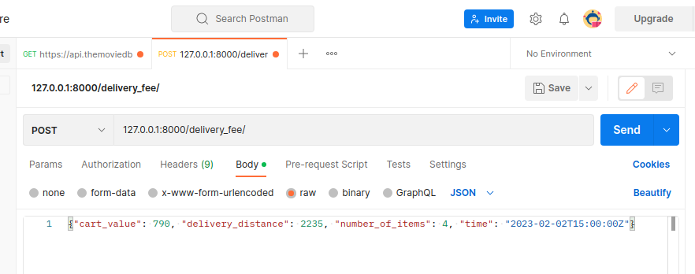

# django_fee_calculator
## My design descisions 
Why did i use a database for storing the variables nessecary for the calculation?
- To give more flexibility one the app is running. The values can change, for example
for an promotion period. So its easier to change these values, without asking a developer to change them. Anyone who has access to the browser backend can change these values. 

Why did i use a class based view and put every calculation step in a seperate method?
- Because of this separation, its possible to access the different steps on their own. And its easy to add or remove steps by just not calling theses method in the post method.  
- and its also possible to test these steps specifically.


## Installing the virtual env and the requirements
Navigate to the root of the project. 
This is the directory with the manage.py

### If you are using venv
You need to have pip installed
```console
# install the virtual environment
python3 -m venv venv

# and load it
source venv/bin/activate

# install the requiremts
pip install -r < requirements.txt
```

### If you are using pipenv
You need to have pipenv installed
```console
# install the virtual environment
pipenv install

# and load it
pipenv shell
```

### Start the application
```console
python manage.py runserver
```

### How to do requests
I constructed the app to work with e.g. postman 

the url of the api is:] 
[http://127.0.0.1:8000/delivery_fee/](http://127.0.0.1:8000/delivery_fee/)

It is a post request with a json object as request body:


```json
# example json object
{"cart_value": 790, "delivery_distance": 2235, "number_of_items": 4, "time": "2021-10-12T13:00:00Z"}
```

### Run unittests

```console
# runs the tests in delivery_fee/test.py
# navigate to the root of the project and run
python manage.py test
```
